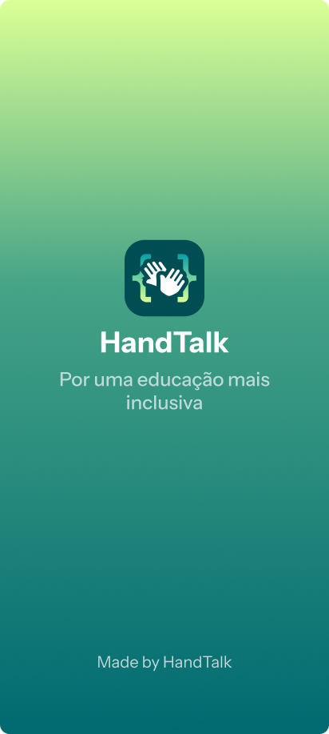

<h1>Projeto Handtalk</h1>

**Universidade Federal Rural de Pernambuco** <br>
**Departamento de Estatística e Informática** <br>
**Bacharelado em Sistemas de Informação** <br>
**Disciplina: Projeto Interdisciplinar para Sistemas de Informação** <br>

<h2>⚙️ Funcionalidades:</h2>

° Cadastro de Usuário (CRUD completo) <br>
° Validador de Cadastro/Login <br>
° Menu Interagível <br>
° Quiz de Verificação de Conteúdo <br>
° Sistema de pontuação (XP) <br>

<h3>Tecnologias Utilizadas</h3>

**Python 3**<br>

**bibliotecas**: <br>
- ``os`` para limpar o terminal <br>
- ``re``para verificar os campos <br>
- ``random``para gerar código de verificação de e-mail <br>

💾 Como Executar o Projeto 
---
1. Certifique-se de ter o **Python 3** instalado em seu sistema.
2. Salve o projeto em um arquivo Python (ex.: ``handtalk.py``)
3. execute o programa no terminal ou prompt de comando

Estrutura do Projeto
---
```
defs.py   #Arquivo contendo as funções do código.
usuario.txt  #Arquivo contendo os dados de cadastro do usuário inseridos manualmente.
verificar.py #Arquivo contendo as restrições necessárias que verificam possiveis erros de entrada inseridas pelo usuário.
main.py   #Arquivo contendo o ponto de entrada do programa (menu).
```
🖥️ Interfaces
-----------
- Terminal:
  


- Interface Gráfica do Usuário (GUI):




Melhorias Futuras:
---
- Video de suporte para conteúdo
- Adição do bando de dados
- Feedback visual 


